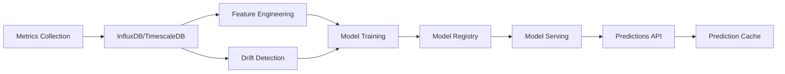
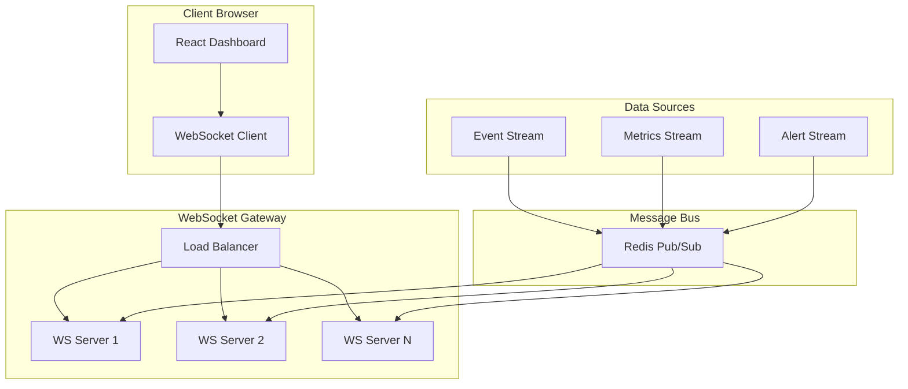
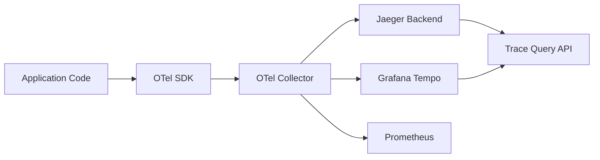
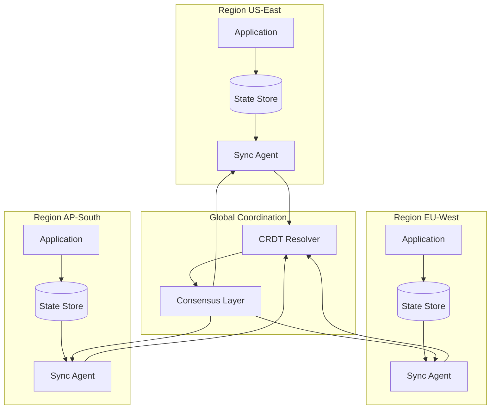
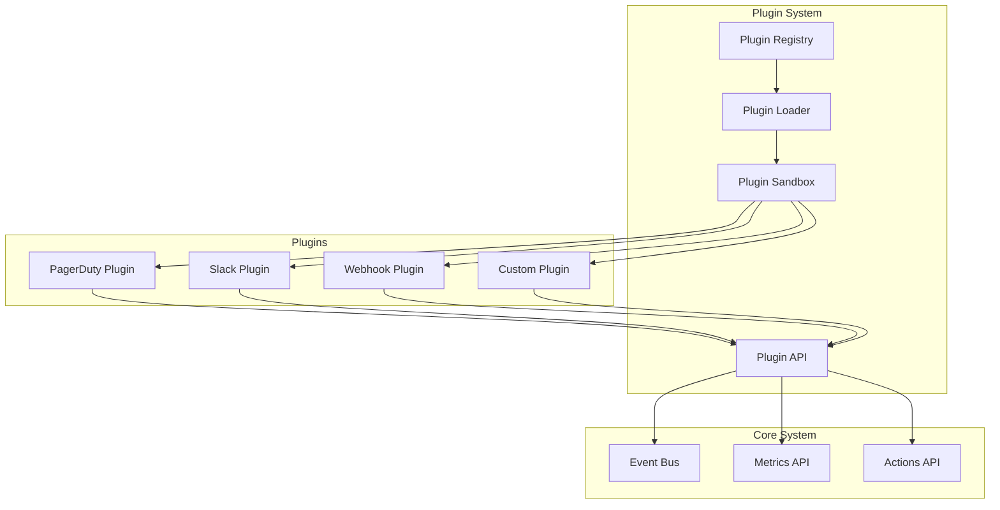
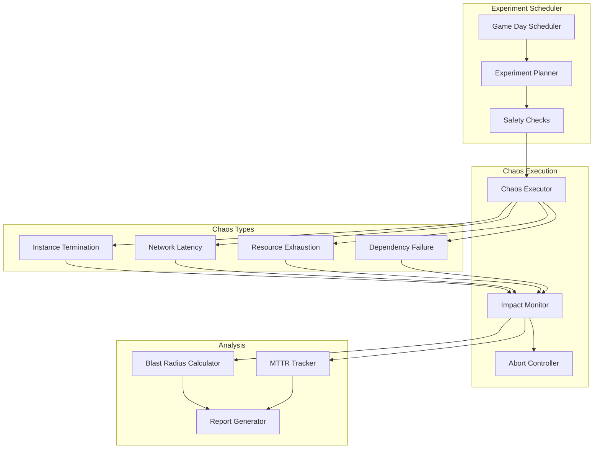
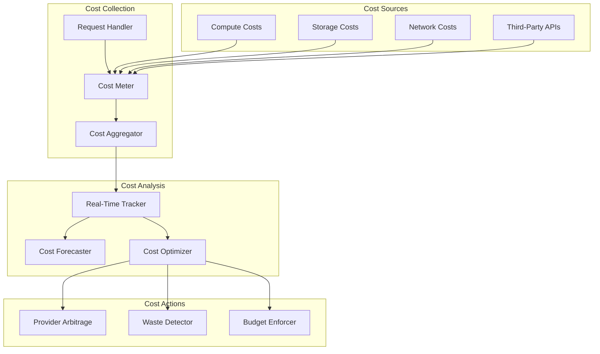

# Design Document: Autonomous Intelligence Layer

## Overview

The Autonomous Intelligence Layer transforms NeuralShell into a proactive, self-learning AI platform that records every decision, predicts failures, provides real-time visibility, and continuously optimizes itself. This design implements a production-ready, scalable architecture using event sourcing for decision history, time-series ML for predictions, WebSocket-based real-time dashboards, distributed tracing with OpenTelemetry, multi-region state synchronization, a plugin system for integrations, reinforcement learning for optimization, automated chaos engineering, and comprehensive cost intelligence.

### Key Design Principles

1. **Event Sourcing First**: All autonomous decisions are immutable events, enabling complete audit trails and time-travel debugging
2. **Predict, Don't React**: ML-based forecasting prevents failures before they occur rather than responding after the fact
3. **Observable by Default**: Every decision, metric, and action is traced, correlated, and visualized in real-time
4. **Learn and Adapt**: Reinforcement learning continuously improves routing, thresholds, and optimization strategies
5. **Cost-Conscious**: Every request tracks its cost, enabling real-time optimization and budget enforcement
6. **Chaos-Tested**: Automated chaos experiments continuously validate resilience and measure blast radius
7. **Multi-Region Native**: State synchronization and geo-aware routing are core architectural concerns
8. **Plugin-Extensible**: Integration points use a plugin architecture for extensibility without core modifications

### System Context

The Autonomous Intelligence Layer sits above the existing autonomous systems (self-healing, auto-scaling, anomaly detection, etc.) and provides:

- **Decision Intelligence Engine**: Event sourcing for all autonomous decisions with replay and quality scoring
- **Predictive Intelligence Engine**: Time-series ML for traffic, failure, cost, and capacity forecasting
- **Visual Command Center**: Real-time WebSocket dashboard with live decision streams and manual overrides
- **Observability Engine**: Distributed tracing, correlation, and performance profiling with OpenTelemetry
- **Behavioral Security Engine**: ML-based anomaly detection, automated incident response, and attack learning
- **Multi-Region Controller**: Geo-aware routing, automatic failover, and state replication
- **Integration Hub**: Plugin architecture for PagerDuty, Slack, CI/CD, webhooks, and custom integrations
- **Self-Learning Optimizer**: Reinforcement learning for routing, threshold tuning, and resource right-sizing
- **Chaos Intelligence Engine**: Automated game days, blast radius measurement, and resilience scoring
- **Cost Intelligence Engine**: Real-time cost tracking, provider arbitrage, waste detection, and budget enforcement


## Architecture

### High-Level Architecture

```mermaid
graph TB
    subgraph "Client Layer"
        WS[WebSocket Clients]
        API[REST API Clients]
    end
    
    subgraph "Visual Command Center"
        Dashboard[Real-Time Dashboard]
        DecisionStream[Live Decision Stream]
        Override[Manual Override Controls]
    end
    
    subgraph "Intelligence Engines"
        DIE[Decision Intelligence Engine]
        PIE[Predictive Intelligence Engine]
        OE[Observability Engine]
        BSE[Behavioral Security Engine]
        SLO[Self-Learning Optimizer]
        CIE[Chaos Intelligence Engine]
        COSTE[Cost Intelligence Engine]
    end
    
    subgraph "Core Services"
        EventStore[(Event Store)]
        TSDB[(Time-Series DB)]
        MLPipeline[ML Pipeline]
        TraceBackend[Trace Backend]
    end
    
    subgraph "Integration Layer"
        IntHub[Integration Hub]
        Plugins[Plugin System]
    end
    
    subgraph "Multi-Region"
        MRC[Multi-Region Controller]
        StateSync[State Synchronization]
    end
    
    subgraph "Existing Autonomous Systems"
        SelfHeal[Self-Healing]
        AutoScale[Auto-Scaling]
        AnomalyDet[Anomaly Detection]
        ThreatDet[Threat Detection]
        CostMgr[Cost Manager]
    end
    
    WS --> Dashboard
    API --> DIE
    Dashboard --> DecisionStream
    Dashboard --> Override
    
    SelfHeal --> DIE
    AutoScale --> DIE
    AnomalyDet --> DIE
    ThreatDet --> DIE
    CostMgr --> DIE
    
    DIE --> EventStore
    DIE --> OE
    PIE --> TSDB
    PIE --> MLPipeline
    OE --> TraceBackend
    BSE --> DIE
    SLO --> MLPipeline
    CIE --> DIE
    COSTE --> TSDB
    
    DIE --> IntHub
    IntHub --> Plugins
    
    MRC --> StateSync
    StateSync --> EventStore
    StateSync --> MLPipeline
    
    DecisionStream --> EventStore
```



### Event Sourcing Architecture

The Decision Intelligence Engine uses event sourcing as the foundation for all autonomous decisions:

**Event Store Design**:
- Append-only log using Kafka or EventStoreDB for immutability and high throughput
- Each decision event contains: event_id, timestamp, decision_type, system_component, context (JSON), action_taken, outcome, trace_id
- Partitioned by decision_type for parallel processing and query efficiency
- Replication factor of 3 for durability with synchronous replication
- Retention: 90 days hot storage, 7 years cold storage (S3/GCS)

**Event Schema**:
```typescript
interface DecisionEvent {
  event_id: string;           // UUID v7 (time-ordered)
  timestamp: number;          // Unix timestamp in microseconds
  decision_type: string;      // e.g., "scaling", "healing", "routing"
  system_component: string;   // e.g., "auto-scaler", "self-healing"
  context: {
    trigger: string;          // What caused the decision
    metrics: Record<string, number>;
    state: Record<string, any>;
  };
  action_taken: {
    type: string;
    parameters: Record<string, any>;
  };
  outcome: {
    status: "success" | "failure" | "partial";
    duration_ms: number;
    impact: Record<string, number>;
  };
  quality_score?: number;     // 0-100, calculated post-decision
  trace_id: string;           // OpenTelemetry trace ID
  span_id: string;            // OpenTelemetry span ID
}
```

**Event Processing Pipeline**:
1. Autonomous system makes decision → emit event to Kafka topic
2. Event Store consumer persists to durable storage (< 10ms)
3. Stream processors calculate quality scores asynchronously
4. Aggregators build materialized views for queries
5. WebSocket gateway pushes events to connected dashboards


### Time-Series ML Pipeline Architecture

The Predictive Intelligence Engine uses a comprehensive ML pipeline for forecasting:

**Data Flow**:


**Time-Series Database**:
- **Primary Choice**: TimescaleDB (PostgreSQL extension) for SQL compatibility and reliability
- **Alternative**: InfluxDB for pure time-series workloads
- **Schema**: Metrics stored with 1-second granularity, downsampled to 1-minute after 90 days
- **Retention**: 90 days at 1s, 1 year at 1m, 7 years at 1h
- **Compression**: Automatic compression achieving 10-20x reduction
- **Indexes**: Hypertable partitioning by time, indexes on metric_name and tags

**ML Models**:
1. **Traffic Forecasting**: Prophet (Facebook) for seasonal patterns + LSTM for complex patterns
2. **Failure Prediction**: Isolation Forest for anomaly detection + XGBoost for classification
3. **Cost Forecasting**: ARIMA for linear trends + Prophet for seasonality
4. **Capacity Planning**: Linear regression with growth projections + Monte Carlo simulation

**Model Training Pipeline**:
- **Framework**: MLflow for experiment tracking and model registry
- **Training Schedule**: Weekly retraining or on-demand when drift detected
- **Training Data**: Rolling 90-day window with feature engineering
- **Validation**: Time-series cross-validation with expanding window
- **Deployment**: Blue-green deployment with A/B testing (10% traffic to new model)

**Model Serving**:
- **Serving Framework**: TensorFlow Serving or TorchServe for model inference
- **Latency Target**: < 50ms at p99 for prediction requests
- **Caching**: Redis cache for predictions with 5-minute TTL
- **Batch Predictions**: Pre-compute forecasts every 5 minutes for dashboard display
- **API**: gRPC for internal services, REST for external clients

**Drift Detection**:
- Monitor prediction accuracy vs actual values every hour
- Track input distribution changes using KL divergence
- Alert when accuracy degrades > 10% or distribution shift > 0.3
- Automatic retraining trigger on drift detection


### Real-Time WebSocket Dashboard Architecture

The Visual Command Center provides real-time visibility using WebSocket streaming:

**WebSocket Architecture**:


**WebSocket Server Implementation**:
- **Framework**: Node.js with `ws` library or Go with `gorilla/websocket`
- **Scaling**: Horizontal scaling with Redis Pub/Sub for message distribution
- **Connection Management**: Sticky sessions via load balancer or connection state in Redis
- **Heartbeat**: Ping/pong every 30 seconds to detect dead connections
- **Reconnection**: Exponential backoff (1s, 2s, 4s, 8s, max 30s)
- **Compression**: Per-message deflate for 3-5x message size reduction

**Message Protocol**:
```typescript
interface WebSocketMessage {
  type: "decision" | "metric" | "alert" | "incident" | "override";
  timestamp: number;
  data: any;
  sequence: number;  // For ordering and gap detection
}

// Decision event message
interface DecisionMessage {
  type: "decision";
  timestamp: number;
  data: {
    event_id: string;
    decision_type: string;
    component: string;
    action: string;
    outcome: "success" | "failure" | "pending";
    quality_score?: number;
  };
  sequence: number;
}

// Metric update message
interface MetricMessage {
  type: "metric";
  timestamp: number;
  data: {
    metric_name: string;
    value: number;
    tags: Record<string, string>;
  };
  sequence: number;
}
```

**Dashboard Features**:
1. **System Overview**: Real-time health status, traffic volume, error rates, costs
2. **Decision Stream**: Live feed of autonomous decisions with filtering (type, component, outcome)
3. **Metric Graphs**: Time-series charts with 1-second updates, zoom/pan, anomaly overlays
4. **Incident Timeline**: Visual timeline of incidents with events, actions, and outcomes
5. **Manual Override Panel**: Controls to pause/resume autonomous systems with confirmation dialogs
6. **Prediction Display**: Forecasts for traffic, failures, costs with confidence intervals

**Performance Optimizations**:
- **Throttling**: Limit updates to 10 messages/second per client to prevent overwhelming browsers
- **Aggregation**: Batch multiple metric updates into single messages
- **Sampling**: For high-frequency events, sample at 10% and show "X more events" indicators
- **Lazy Loading**: Load historical data on-demand when scrolling timeline
- **Virtual Scrolling**: Render only visible rows in decision stream (react-window)


### Distributed Tracing with OpenTelemetry

The Observability Engine provides end-to-end tracing for all autonomous decisions:

**OpenTelemetry Architecture**:


**Instrumentation Strategy**:
- **Automatic Instrumentation**: Use OTel auto-instrumentation for HTTP, database, Redis
- **Manual Instrumentation**: Add custom spans for autonomous decision logic
- **Context Propagation**: W3C Trace Context headers for cross-service tracing
- **Sampling**: Adaptive sampling (100% for errors, 10% for success, 1% for high-volume endpoints)

**Span Structure for Autonomous Decisions**:
```typescript
// Root span for autonomous decision
const decisionSpan = tracer.startSpan("autonomous.decision", {
  attributes: {
    "decision.type": "scaling",
    "decision.component": "auto-scaler",
    "decision.trigger": "cpu_threshold_exceeded"
  }
});

// Child spans for decision phases
const analysisSpan = tracer.startSpan("decision.analysis", { parent: decisionSpan });
// ... analysis logic
analysisSpan.end();

const actionSpan = tracer.startSpan("decision.action", { parent: decisionSpan });
// ... action execution
actionSpan.setAttribute("action.type", "scale_up");
actionSpan.setAttribute("action.instances", 3);
actionSpan.end();

const verificationSpan = tracer.startSpan("decision.verification", { parent: decisionSpan });
// ... verify outcome
verificationSpan.setAttribute("outcome.status", "success");
verificationSpan.end();

decisionSpan.setAttribute("decision.quality_score", 85);
decisionSpan.end();
```

**Trace Backend Selection**:
- **Primary**: Grafana Tempo for cost-effective, scalable trace storage
- **Alternative**: Jaeger for mature ecosystem and UI
- **Storage**: S3/GCS for long-term trace retention (90 days)
- **Query Performance**: Tempo with TraceQL for complex queries

**Correlation Engine Implementation**:
- **Anomaly-to-Healing Correlation**: Link anomaly detection spans to healing action spans via trace_id
- **Outcome Tracking**: Add outcome spans that reference original decision spans
- **Success Rate Calculation**: Aggregate spans by decision_type and outcome.status
- **Pattern Detection**: Analyze span attributes to identify failing patterns (e.g., specific thresholds, regions)

**Performance Profiling**:
- **Hot Path Detection**: Analyze span frequency and duration to identify hot paths
- **Flame Graphs**: Generate flame graphs from span data for CPU profiling visualization
- **Critical Path Analysis**: Identify longest span chains that determine minimum latency
- **Dependency Mapping**: Build service dependency graph from span relationships


### Multi-Region State Synchronization

The Multi-Region Controller ensures consistent state across geographic regions:

**State Synchronization Architecture**:


**State Types and Synchronization Strategy**:

1. **Configuration State** (Strong Consistency):
   - Autonomous system settings, thresholds, feature flags
   - Synchronization: Raft consensus (etcd or Consul) for strong consistency
   - Propagation: < 10 seconds across all regions
   - Conflict Resolution: Last-write-wins with version vectors

2. **ML Model State** (Eventual Consistency):
   - Trained model weights, hyperparameters, metadata
   - Synchronization: S3/GCS replication with notification webhooks
   - Propagation: < 60 seconds for model updates
   - Versioning: Semantic versioning with rollback capability

3. **Decision History** (Eventual Consistency):
   - Event store replication for audit and replay
   - Synchronization: Kafka MirrorMaker 2 for cross-region replication
   - Propagation: < 5 seconds for event replication
   - Conflict Resolution: Not applicable (append-only)

4. **Session State** (Eventual Consistency with CRDTs):
   - User sessions, authentication tokens, preferences
   - Synchronization: Redis with active-active replication (Redis Enterprise) or CRDTs
   - Propagation: < 500ms for session updates
   - Conflict Resolution: LWW-Register CRDT for session data

**CRDT Implementation**:
```typescript
// Using Yjs or Automerge for CRDT implementation
import * as Y from 'yjs';

class RegionalStateManager {
  private doc: Y.Doc;
  private syncProvider: WebsocketProvider;
  
  constructor(region: string) {
    this.doc = new Y.Doc();
    this.syncProvider = new WebsocketProvider(
      'wss://sync.neuralshell.io',
      `state-${region}`,
      this.doc
    );
  }
  
  // Update configuration with automatic conflict resolution
  updateConfig(key: string, value: any): void {
    const config = this.doc.getMap('config');
    config.set(key, value);
    // CRDT automatically handles conflicts across regions
  }
  
  // Get current configuration
  getConfig(key: string): any {
    const config = this.doc.getMap('config');
    return config.get(key);
  }
  
  // Subscribe to configuration changes
  onConfigChange(callback: (key: string, value: any) => void): void {
    const config = this.doc.getMap('config');
    config.observe((event) => {
      event.changes.keys.forEach((change, key) => {
        callback(key, config.get(key));
      });
    });
  }
}
```

**Geo-Aware Routing**:
- **GeoDNS**: Route users to nearest region based on geographic location
- **Latency-Based Routing**: Measure actual latency and route to fastest region
- **Health-Aware Routing**: Exclude unhealthy regions from routing decisions
- **Capacity-Aware Routing**: Consider region capacity and avoid overloaded regions

**Failover Strategy**:
1. **Detection**: Health checks every 10 seconds, 3 consecutive failures trigger failover
2. **Capacity Verification**: Ensure target region can handle additional traffic (< 80% capacity)
3. **Gradual Failover**: Shift traffic in 10% increments every 30 seconds
4. **State Verification**: Verify critical state is replicated before completing failover
5. **Failback**: Automatic failback after 5 minutes of healthy status with gradual traffic shift


### Plugin System for Integrations

The Integration Hub provides a flexible plugin architecture for external integrations:

**Plugin Architecture**:


**Plugin Manifest**:
```yaml
# plugin.yaml
name: pagerduty-integration
version: 1.2.0
description: PagerDuty incident management integration
author: NeuralShell Team
license: MIT

capabilities:
  - incident_creation
  - incident_updates
  - on_call_routing

dependencies:
  - name: "@pagerduty/pdjs"
    version: "^5.0.0"

configuration:
  - name: api_key
    type: secret
    required: true
    description: PagerDuty API key
  - name: service_id
    type: string
    required: true
    description: PagerDuty service ID
  - name: escalation_policy
    type: string
    required: false
    description: Escalation policy ID

events:
  subscribe:
    - incident.created
    - incident.resolved
    - anomaly.detected
  publish:
    - pagerduty.incident_created
    - pagerduty.incident_acknowledged

permissions:
  - network.http.outbound
  - secrets.read
  - events.publish

health_check:
  endpoint: /health
  interval: 60s
  timeout: 5s
```

**Plugin API Interface**:
```typescript
// Plugin SDK interface
interface PluginContext {
  // Event subscription
  on(event: string, handler: (data: any) => Promise<void>): void;
  
  // Event publishing
  emit(event: string, data: any): Promise<void>;
  
  // Metrics querying
  queryMetrics(query: MetricQuery): Promise<MetricResult[]>;
  
  // Action triggering
  triggerAction(action: string, params: any): Promise<ActionResult>;
  
  // Configuration access
  getConfig(key: string): string | undefined;
  getSecret(key: string): Promise<string | undefined>;
  
  // Logging
  log: {
    info(message: string, meta?: any): void;
    warn(message: string, meta?: any): void;
    error(message: string, meta?: any): void;
  };
}

// Plugin implementation interface
interface Plugin {
  name: string;
  version: string;
  
  // Lifecycle hooks
  initialize(context: PluginContext): Promise<void>;
  start(): Promise<void>;
  stop(): Promise<void>;
  healthCheck(): Promise<{ healthy: boolean; message?: string }>;
}

// Example plugin implementation
class PagerDutyPlugin implements Plugin {
  name = "pagerduty-integration";
  version = "1.2.0";
  
  private context!: PluginContext;
  private pdClient: any;
  
  async initialize(context: PluginContext): Promise<void> {
    this.context = context;
    
    const apiKey = await context.getSecret("api_key");
    this.pdClient = new PagerDutyClient(apiKey);
    
    // Subscribe to incidents
    context.on("incident.created", this.handleIncident.bind(this));
    context.on("anomaly.detected", this.handleAnomaly.bind(this));
  }
  
  async start(): Promise<void> {
    this.context.log.info("PagerDuty plugin started");
  }
  
  async stop(): Promise<void> {
    this.context.log.info("PagerDuty plugin stopped");
  }
  
  async healthCheck(): Promise<{ healthy: boolean; message?: string }> {
    try {
      await this.pdClient.testConnection();
      return { healthy: true };
    } catch (error) {
      return { healthy: false, message: error.message };
    }
  }
  
  private async handleIncident(data: any): Promise<void> {
    const serviceId = this.context.getConfig("service_id");
    
    const incident = await this.pdClient.createIncident({
      title: data.title,
      service: { id: serviceId, type: "service_reference" },
      urgency: data.severity === "critical" ? "high" : "low",
      body: {
        type: "incident_body",
        details: data.description
      }
    });
    
    await this.context.emit("pagerduty.incident_created", {
      incident_id: incident.id,
      original_incident: data.id
    });
  }
  
  private async handleAnomaly(data: any): Promise<void> {
    if (data.confidence > 0.8) {
      await this.handleIncident({
        title: `Anomaly Detected: ${data.metric}`,
        severity: "warning",
        description: `Anomaly detected in ${data.metric} with confidence ${data.confidence}`
      });
    }
  }
}
```

**Plugin Isolation and Security**:
- **Sandboxing**: Run plugins in isolated V8 contexts or separate processes
- **Resource Limits**: CPU (10% per plugin), memory (100MB per plugin), network (rate limited)
- **Permission System**: Explicit permissions for network, secrets, events, actions
- **Secret Management**: Secrets encrypted at rest, injected at runtime, never logged
- **Audit Logging**: All plugin actions logged with plugin name, action, and outcome

**Built-in Plugins**:
1. **PagerDuty**: Incident creation, updates, on-call routing
2. **Opsgenie**: Alert management, escalation policies
3. **Slack**: Channel notifications, interactive buttons, slash commands
4. **Microsoft Teams**: Adaptive cards, action buttons
5. **Webhook**: Generic HTTP webhook delivery with retries
6. **CI/CD Health Gate**: GitHub Actions, GitLab CI, Jenkins integration
7. **Runbook Generator**: Automatic runbook creation from incidents


### Reinforcement Learning for Optimization

The Self-Learning Optimizer uses reinforcement learning to continuously improve system decisions:

**Reinforcement Learning Architecture**:
```mermaid
graph TB
    subgraph "RL Agent"
        State[State Observation]
        Policy[Policy Network]
        Action[Action Selection]
        Reward[Reward Calculation]
    end
    
    subgraph "Environment"
        System[System State]
        Metrics[Metrics Collection]
        Outcome[Outcome Tracking]
    end
    
    subgraph "Training"
        Experience[Experience Replay]
        Training[Model Training]
        Evaluation[Policy Evaluation]
    end
    
    System --> State
    State --> Policy
    Policy --> Action
    Action --> System
    System --> Metrics
    Metrics --> Outcome
    Outcome --> Reward
    Reward --> Experience
    Experience --> Training
    Training --> Policy
    Policy --> Evaluation
```

**RL Framework Selection**:
- **Primary**: Ray RLlib for distributed RL training and serving
- **Algorithm**: Proximal Policy Optimization (PPO) for stable learning
- **Alternative**: Soft Actor-Critic (SAC) for continuous action spaces

**State Space Design**:
```typescript
interface RLState {
  // Traffic metrics
  traffic: {
    current_rps: number;
    trend_5m: number;      // % change over 5 minutes
    trend_1h: number;      // % change over 1 hour
    predicted_rps: number; // ML forecast
  };
  
  // Performance metrics
  performance: {
    p50_latency: number;
    p95_latency: number;
    p99_latency: number;
    error_rate: number;
  };
  
  // Resource metrics
  resources: {
    cpu_utilization: number;
    memory_utilization: number;
    instance_count: number;
    available_capacity: number;
  };
  
  // Cost metrics
  cost: {
    current_hourly_rate: number;
    spot_price_trend: number;
    budget_remaining: number;
  };
  
  // Time context
  time: {
    hour_of_day: number;      // 0-23
    day_of_week: number;      // 0-6
    is_peak_hour: boolean;
  };
}
```

**Action Space Design**:
```typescript
// Routing decisions
interface RoutingAction {
  type: "routing";
  provider: "aws" | "gcp" | "azure" | "cloudflare";
  region: string;
  traffic_percentage: number; // 0-100
}

// Scaling decisions
interface ScalingAction {
  type: "scaling";
  target_instances: number;
  use_spot_instances: boolean;
}

// Threshold tuning
interface ThresholdAction {
  type: "threshold";
  metric: string;
  threshold_value: number;
  adjustment_factor: number; // -0.5 to +0.5
}
```

**Reward Function Design**:
```typescript
function calculateReward(state: RLState, action: any, outcome: Outcome): number {
  let reward = 0;
  
  // Latency reward (higher is better, lower latency)
  const latencyScore = 1.0 - (outcome.p95_latency / 1000); // Normalize to 0-1
  reward += latencyScore * 0.3;
  
  // Availability reward (higher is better)
  const availabilityScore = 1.0 - outcome.error_rate;
  reward += availabilityScore * 0.4;
  
  // Cost efficiency reward (lower cost is better)
  const costScore = 1.0 - (outcome.cost / state.cost.current_hourly_rate);
  reward += costScore * 0.2;
  
  // SLA compliance reward (binary)
  const slaCompliance = outcome.p95_latency < 500 && outcome.error_rate < 0.01;
  reward += slaCompliance ? 0.1 : -0.5;
  
  return reward; // Range: -0.5 to 1.0
}
```

**Training Strategy**:
- **Exploration**: ε-greedy with ε = 0.1 (10% random actions)
- **Experience Replay**: Store last 100,000 (state, action, reward, next_state) tuples
- **Batch Size**: 256 experiences per training batch
- **Training Frequency**: Every 15 minutes or 1,000 new experiences
- **Model Updates**: Gradual rollout over 24 hours with A/B testing

**Safety Constraints**:
- **Action Bounds**: Limit actions to safe ranges (e.g., max 2x instance scaling per decision)
- **Rollback Mechanism**: Automatic rollback if reward drops below baseline for 5 minutes
- **Human Override**: Manual override to disable RL and revert to rule-based decisions
- **Simulation Mode**: Test new policies in simulation before production deployment

**Threshold Auto-Tuning**:
```typescript
class ThresholdOptimizer {
  private rlAgent: RLAgent;
  private thresholds: Map<string, number>;
  
  async optimizeThreshold(metric: string): Promise<void> {
    const currentThreshold = this.thresholds.get(metric);
    const state = await this.getSystemState();
    
    // Get RL agent's recommended adjustment
    const action = await this.rlAgent.selectAction(state);
    
    if (action.type === "threshold" && action.metric === metric) {
      const newThreshold = currentThreshold * (1 + action.adjustment_factor);
      
      // Apply with safety bounds
      const boundedThreshold = this.applyBounds(metric, newThreshold);
      this.thresholds.set(metric, boundedThreshold);
      
      // Track outcome for reward calculation
      await this.trackThresholdChange(metric, currentThreshold, boundedThreshold);
    }
  }
  
  private applyBounds(metric: string, value: number): number {
    const bounds = {
      "cpu_threshold": { min: 0.5, max: 0.9 },
      "memory_threshold": { min: 0.6, max: 0.95 },
      "error_rate_threshold": { min: 0.001, max: 0.05 }
    };
    
    const { min, max } = bounds[metric] || { min: 0, max: 1 };
    return Math.max(min, Math.min(max, value));
  }
}
```


### Chaos Engineering Automation

The Chaos Intelligence Engine provides automated chaos experiments and resilience validation:

**Chaos Experiment Framework**:


**Chaos Experiment Types**:

1. **Instance Termination**:
```typescript
interface InstanceTerminationExperiment {
  type: "instance_termination";
  target: {
    service: string;
    region: string;
    instance_count: number; // Number of instances to terminate
    selection: "random" | "highest_load" | "oldest";
  };
  duration: number; // How long to keep instances down (seconds)
  blast_radius_limit: {
    max_affected_users: number;
    max_error_rate: number;
  };
}
```

2. **Network Latency Injection**:
```typescript
interface NetworkLatencyExperiment {
  type: "network_latency";
  target: {
    service: string;
    dependency: string; // Which dependency to add latency to
    latency_ms: number;
    jitter_ms: number;
  };
  duration: number;
  blast_radius_limit: {
    max_p95_latency: number;
    max_timeout_rate: number;
  };
}
```

3. **Resource Exhaustion**:
```typescript
interface ResourceExhaustionExperiment {
  type: "resource_exhaustion";
  target: {
    service: string;
    resource: "cpu" | "memory" | "disk" | "connections";
    utilization_target: number; // 0-100%
  };
  duration: number;
  blast_radius_limit: {
    max_error_rate: number;
    max_latency_increase: number;
  };
}
```

**Safety Mechanisms**:
```typescript
class ChaosSafetyController {
  async canRunExperiment(experiment: ChaosExperiment): Promise<boolean> {
    // Check 1: No active incidents
    const activeIncidents = await this.getActiveIncidents();
    if (activeIncidents.length > 0) {
      return false;
    }
    
    // Check 2: System health is good
    const health = await this.getSystemHealth();
    if (health.error_rate > 0.01 || health.p95_latency > 500) {
      return false;
    }
    
    // Check 3: Not during peak hours (unless explicitly allowed)
    if (this.isPeakHour() && !experiment.allow_peak_hours) {
      return false;
    }
    
    // Check 4: Sufficient capacity for failover
    const capacity = await this.getAvailableCapacity();
    if (capacity < 0.3) { // Need 30% spare capacity
      return false;
    }
    
    // Check 5: No recent chaos experiments (cooldown period)
    const lastExperiment = await this.getLastExperiment();
    if (Date.now() - lastExperiment.timestamp < 3600000) { // 1 hour cooldown
      return false;
    }
    
    return true;
  }
  
  async monitorExperiment(experiment: ChaosExperiment): Promise<void> {
    const startTime = Date.now();
    const checkInterval = 5000; // Check every 5 seconds
    
    while (Date.now() - startTime < experiment.duration * 1000) {
      const metrics = await this.getCurrentMetrics();
      
      // Check blast radius limits
      if (this.exceedsBlastRadius(metrics, experiment.blast_radius_limit)) {
        await this.abortExperiment(experiment, "Blast radius exceeded");
        return;
      }
      
      // Check for cascading failures
      if (this.detectsCascadingFailure(metrics)) {
        await this.abortExperiment(experiment, "Cascading failure detected");
        return;
      }
      
      await this.sleep(checkInterval);
    }
  }
  
  private exceedsBlastRadius(metrics: Metrics, limits: BlastRadiusLimit): boolean {
    if (limits.max_error_rate && metrics.error_rate > limits.max_error_rate) {
      return true;
    }
    if (limits.max_affected_users && metrics.affected_users > limits.max_affected_users) {
      return true;
    }
    if (limits.max_p95_latency && metrics.p95_latency > limits.max_p95_latency) {
      return true;
    }
    return false;
  }
}
```

**Blast Radius Calculation**:
```typescript
class BlastRadiusCalculator {
  async calculateBlastRadius(experiment: ChaosExperiment): Promise<BlastRadius> {
    const beforeMetrics = await this.getMetricsBeforeExperiment(experiment);
    const duringMetrics = await this.getMetricsDuringExperiment(experiment);
    
    return {
      affected_requests: duringMetrics.failed_requests - beforeMetrics.failed_requests,
      affected_users: this.estimateAffectedUsers(duringMetrics),
      error_rate_increase: duringMetrics.error_rate - beforeMetrics.error_rate,
      latency_increase: duringMetrics.p95_latency - beforeMetrics.p95_latency,
      affected_services: this.identifyAffectedServices(duringMetrics),
      containment_effectiveness: this.calculateContainment(duringMetrics)
    };
  }
  
  private estimateAffectedUsers(metrics: Metrics): number {
    // Estimate unique users affected based on failed requests and session data
    const avgRequestsPerUser = 10;
    return Math.ceil(metrics.failed_requests / avgRequestsPerUser);
  }
  
  private calculateContainment(metrics: Metrics): number {
    // Measure how well the failure was contained (0-1 scale)
    const totalServices = metrics.total_services;
    const affectedServices = metrics.affected_services.length;
    return 1.0 - (affectedServices / totalServices);
  }
}
```

**Game Day Automation**:
```typescript
class GameDayScheduler {
  async scheduleGameDay(config: GameDayConfig): Promise<void> {
    const experiments = [
      // Progressive chaos experiments
      { type: "instance_termination", instance_count: 1 },
      { type: "network_latency", latency_ms: 100 },
      { type: "network_latency", latency_ms: 500 },
      { type: "resource_exhaustion", resource: "cpu", utilization_target: 90 },
      { type: "instance_termination", instance_count: 3 },
      { type: "dependency_failure", dependency: "database" }
    ];
    
    const results = [];
    
    for (const experiment of experiments) {
      // Wait for system to stabilize
      await this.waitForStableState();
      
      // Run experiment
      const result = await this.runExperiment(experiment);
      results.push(result);
      
      // Analyze results
      if (!result.success) {
        console.log(`Experiment failed: ${result.reason}`);
        break; // Stop game day if experiment fails safety checks
      }
      
      // Cooldown period
      await this.sleep(300000); // 5 minutes between experiments
    }
    
    // Generate game day report
    await this.generateGameDayReport(results);
  }
}
```

**Resilience Scoring**:
```typescript
function calculateResilienceScore(component: string, history: ExperimentHistory[]): number {
  let score = 100;
  
  // Deduct points for failures
  const failures = history.filter(e => e.component === component && !e.recovered);
  score -= failures.length * 10;
  
  // Deduct points for slow recovery
  const slowRecoveries = history.filter(e => e.component === component && e.mttr > 60);
  score -= slowRecoveries.length * 5;
  
  // Deduct points for large blast radius
  const largeBlastRadius = history.filter(e => e.component === component && e.blast_radius > 0.3);
  score -= largeBlastRadius.length * 5;
  
  // Bonus points for consistent fast recovery
  const fastRecoveries = history.filter(e => e.component === component && e.mttr < 30);
  score += fastRecoveries.length * 2;
  
  return Math.max(0, Math.min(100, score));
}
```


### Cost Tracking and Optimization Engine

The Cost Intelligence Engine provides real-time cost tracking and automated optimization:

**Cost Tracking Architecture**:


**Per-Request Cost Calculation**:
```typescript
class CostMeter {
  async calculateRequestCost(request: Request, response: Response): Promise<Cost> {
    const costs = {
      compute: 0,
      storage: 0,
      network: 0,
      api: 0
    };
    
    // Compute cost (based on execution time and instance type)
    const executionTimeMs = response.duration;
    const instanceCostPerMs = this.getInstanceCostPerMs(request.instance_type);
    costs.compute = executionTimeMs * instanceCostPerMs;
    
    // Storage cost (based on data read/written)
    const storageOps = response.storage_operations;
    costs.storage = this.calculateStorageCost(storageOps);
    
    // Network cost (based on data transferred)
    const bytesTransferred = response.body.length + request.body.length;
    costs.network = this.calculateNetworkCost(bytesTransferred, request.region);
    
    // Third-party API costs
    const apiCalls = response.api_calls || [];
    costs.api = apiCalls.reduce((sum, call) => sum + this.getAPICost(call), 0);
    
    const totalCost = Object.values(costs).reduce((sum, cost) => sum + cost, 0);
    
    return {
      total: totalCost,
      breakdown: costs,
      timestamp: Date.now(),
      request_id: request.id,
      endpoint: request.path,
      user_id: request.user_id
    };
  }
  
  private getInstanceCostPerMs(instanceType: string): number {
    // Cost per millisecond for different instance types
    const costs = {
      "t3.micro": 0.0104 / 3600 / 1000,    // $0.0104/hour
      "t3.small": 0.0208 / 3600 / 1000,    // $0.0208/hour
      "c5.large": 0.085 / 3600 / 1000,     // $0.085/hour
      "c5.xlarge": 0.17 / 3600 / 1000      // $0.17/hour
    };
    return costs[instanceType] || 0;
  }
  
  private calculateStorageCost(ops: StorageOperation[]): number {
    let cost = 0;
    for (const op of ops) {
      if (op.type === "read") {
        cost += op.bytes * 0.0004 / (1024 * 1024 * 1024); // $0.0004 per GB read
      } else if (op.type === "write") {
        cost += op.bytes * 0.005 / (1024 * 1024 * 1024);  // $0.005 per GB write
      }
    }
    return cost;
  }
  
  private calculateNetworkCost(bytes: number, region: string): number {
    // Network egress costs vary by region
    const costPerGB = {
      "us-east-1": 0.09,
      "eu-west-1": 0.09,
      "ap-south-1": 0.11
    }[region] || 0.09;
    
    return (bytes / (1024 * 1024 * 1024)) * costPerGB;
  }
  
  private getAPICost(apiCall: APICall): number {
    // Third-party API costs
    const costs = {
      "openai": 0.002,      // $0.002 per request (average)
      "stripe": 0.0001,     // $0.0001 per request
      "sendgrid": 0.0001    // $0.0001 per email
    };
    return costs[apiCall.provider] || 0;
  }
}
```

**Provider Arbitrage**:
```typescript
class ProviderArbitrage {
  private providers = ["aws", "gcp", "azure", "cloudflare"];
  
  async findOptimalProvider(workload: Workload): Promise<ProviderRecommendation> {
    const costs = await Promise.all(
      this.providers.map(provider => this.calculateProviderCost(provider, workload))
    );
    
    // Sort by total cost
    costs.sort((a, b) => a.total_cost - b.total_cost);
    
    const cheapest = costs[0];
    const current = costs.find(c => c.provider === workload.current_provider);
    
    // Calculate migration cost
    const migrationCost = this.estimateMigrationCost(
      workload.current_provider,
      cheapest.provider,
      workload
    );
    
    // Calculate break-even time
    const monthlySavings = (current.total_cost - cheapest.total_cost) * 730; // hours per month
    const breakEvenDays = migrationCost / (monthlySavings / 30);
    
    return {
      recommended_provider: cheapest.provider,
      current_cost: current.total_cost,
      recommended_cost: cheapest.total_cost,
      savings_per_hour: current.total_cost - cheapest.total_cost,
      migration_cost: migrationCost,
      break_even_days: breakEvenDays,
      should_migrate: breakEvenDays < 30 // Migrate if break-even within 30 days
    };
  }
  
  private async calculateProviderCost(provider: string, workload: Workload): Promise<ProviderCost> {
    // Get current spot pricing
    const spotPrice = await this.getSpotPrice(provider, workload.instance_type, workload.region);
    
    // Calculate compute cost
    const computeCost = spotPrice * workload.hours_per_month;
    
    // Calculate storage cost
    const storageCost = this.getStorageCost(provider, workload.storage_gb);
    
    // Calculate network cost
    const networkCost = this.getNetworkCost(provider, workload.network_gb);
    
    return {
      provider,
      compute_cost: computeCost,
      storage_cost: storageCost,
      network_cost: networkCost,
      total_cost: computeCost + storageCost + networkCost
    };
  }
  
  private async getSpotPrice(provider: string, instanceType: string, region: string): Promise<number> {
    // Query real-time spot pricing APIs
    const apis = {
      "aws": () => this.awsSpotPricing(instanceType, region),
      "gcp": () => this.gcpSpotPricing(instanceType, region),
      "azure": () => this.azureSpotPricing(instanceType, region)
    };
    
    return await apis[provider]();
  }
}
```

**Waste Detection**:
```typescript
class WasteDetector {
  async detectWaste(): Promise<WasteReport[]> {
    const waste: WasteReport[] = [];
    
    // Detect idle instances
    const idleInstances = await this.findIdleInstances();
    waste.push(...idleInstances.map(instance => ({
      type: "idle_instance",
      resource_id: instance.id,
      cost_per_month: instance.cost * 730,
      recommendation: "Terminate instance",
      confidence: 0.95
    })));
    
    // Detect orphaned storage
    const orphanedStorage = await this.findOrphanedStorage();
    waste.push(...orphanedStorage.map(storage => ({
      type: "orphaned_storage",
      resource_id: storage.id,
      cost_per_month: storage.size_gb * 0.10, // $0.10 per GB per month
      recommendation: "Delete storage volume",
      confidence: 0.90
    })));
    
    // Detect unused load balancers
    const unusedLBs = await this.findUnusedLoadBalancers();
    waste.push(...unusedLBs.map(lb => ({
      type: "unused_load_balancer",
      resource_id: lb.id,
      cost_per_month: 18, // ~$18 per month per LB
      recommendation: "Delete load balancer",
      confidence: 0.85
    })));
    
    // Detect oversized instances
    const oversizedInstances = await this.findOversizedInstances();
    waste.push(...oversizedInstances.map(instance => ({
      type: "oversized_instance",
      resource_id: instance.id,
      cost_per_month: instance.potential_savings * 730,
      recommendation: `Downsize to ${instance.recommended_size}`,
      confidence: 0.80
    })));
    
    return waste;
  }
  
  private async findIdleInstances(): Promise<IdleInstance[]> {
    const instances = await this.getAllInstances();
    const idle = [];
    
    for (const instance of instances) {
      const metrics = await this.getInstanceMetrics(instance.id, 7); // 7 days
      
      const avgCPU = metrics.cpu.reduce((sum, v) => sum + v, 0) / metrics.cpu.length;
      const avgNetwork = metrics.network.reduce((sum, v) => sum + v, 0) / metrics.network.length;
      
      if (avgCPU < 5 && avgNetwork < 1000) { // < 5% CPU and < 1KB/s network
        idle.push(instance);
      }
    }
    
    return idle;
  }
  
  private async findOversizedInstances(): Promise<OversizedInstance[]> {
    const instances = await this.getAllInstances();
    const oversized = [];
    
    for (const instance of instances) {
      const metrics = await this.getInstanceMetrics(instance.id, 30); // 30 days
      
      const p95CPU = this.percentile(metrics.cpu, 0.95);
      const p95Memory = this.percentile(metrics.memory, 0.95);
      
      // If p95 utilization is below 40%, recommend downsizing
      if (p95CPU < 40 || p95Memory < 40) {
        const recommendedSize = this.recommendInstanceSize(p95CPU, p95Memory);
        const currentCost = this.getInstanceCost(instance.type);
        const recommendedCost = this.getInstanceCost(recommendedSize);
        
        oversized.push({
          ...instance,
          recommended_size: recommendedSize,
          potential_savings: currentCost - recommendedCost
        });
      }
    }
    
    return oversized;
  }
}
```

**Budget Enforcement**:
```typescript
class BudgetEnforcer {
  private budgets: Map<string, Budget> = new Map();
  
  async enforceBudget(scope: string, amount: number): Promise<void> {
    const currentSpend = await this.getCurrentSpend(scope);
    const budget = this.budgets.get(scope);
    
    if (!budget) {
      throw new Error(`No budget configured for scope: ${scope}`);
    }
    
    const percentUsed = (currentSpend / budget.limit) * 100;
    
    // Alert at 80%
    if (percentUsed >= 80 && percentUsed < 95) {
      await this.sendBudgetAlert(scope, percentUsed, "warning");
    }
    
    // Alert at 95%
    if (percentUsed >= 95 && percentUsed < 100) {
      await this.sendBudgetAlert(scope, percentUsed, "critical");
    }
    
    // Hard stop at 100%
    if (percentUsed >= 100) {
      await this.triggerHardStop(scope);
      throw new Error(`Budget limit exceeded for scope: ${scope}`);
    }
  }
  
  private async triggerHardStop(scope: string): Promise<void> {
    // Stop non-essential workloads
    await this.stopNonEssentialWorkloads(scope);
    
    // Scale down to minimum capacity
    await this.scaleToMinimum(scope);
    
    // Notify stakeholders
    await this.sendBudgetAlert(scope, 100, "hard_stop");
    
    // Log the event
    console.error(`Budget hard stop triggered for scope: ${scope}`);
  }
}
```


## Components and Interfaces

### Decision Intelligence Engine

**Responsibilities**:
- Record all autonomous decisions as immutable events
- Provide query and replay capabilities for decision history
- Calculate decision quality scores using ML
- Support A/B testing of decision strategies
- Enable time-travel debugging

**Public Interface**:
```typescript
interface DecisionIntelligenceEngine {
  // Event recording
  recordDecision(event: DecisionEvent): Promise<void>;
  
  // Querying
  queryDecisions(query: DecisionQuery): Promise<DecisionEvent[]>;
  queryByTimeRange(start: Date, end: Date): Promise<DecisionEvent[]>;
  queryByType(type: string): Promise<DecisionEvent[]>;
  
  // Replay and debugging
  replayDecisions(timeRange: TimeRange, sandbox: boolean): Promise<ReplayResult>;
  reconstructState(timestamp: Date): Promise<SystemState>;
  
  // Quality scoring
  calculateQualityScore(event: DecisionEvent, outcome: Outcome): Promise<number>;
  getQualityTrends(decisionType: string): Promise<QualityTrend[]>;
  
  // A/B testing
  createABTest(config: ABTestConfig): Promise<string>;
  getABTestResults(testId: string): Promise<ABTestResults>;
}
```

### Predictive Intelligence Engine

**Responsibilities**:
- Forecast traffic, failures, costs, and capacity needs
- Train and serve ML models for predictions
- Detect anomalies in system metrics
- Trigger preventive actions based on predictions

**Public Interface**:
```typescript
interface PredictiveIntelligenceEngine {
  // Traffic forecasting
  forecastTraffic(horizon: number): Promise<TrafficForecast>;
  
  // Failure prediction
  predictFailures(lookAhead: number): Promise<FailurePrediction[]>;
  
  // Cost forecasting
  forecastCosts(horizon: number): Promise<CostForecast>;
  
  // Capacity planning
  projectCapacity(horizon: number): Promise<CapacityProjection>;
  
  // Anomaly detection
  detectAnomalies(metrics: Metric[]): Promise<Anomaly[]>;
  
  // Model management
  trainModel(modelType: string, data: TrainingData): Promise<string>;
  deployModel(modelId: string, strategy: DeploymentStrategy): Promise<void>;
  detectModelDrift(modelId: string): Promise<DriftReport>;
}
```

### Visual Command Center

**Responsibilities**:
- Provide real-time WebSocket dashboard
- Stream decision events and metrics to clients
- Enable manual override controls
- Display incident timelines and playback

**Public Interface**:
```typescript
interface VisualCommandCenter {
  // WebSocket management
  handleConnection(client: WebSocketClient): Promise<void>;
  broadcastEvent(event: DashboardEvent): Promise<void>;
  
  // Dashboard data
  getSystemOverview(): Promise<SystemOverview>;
  getDecisionStream(filters: StreamFilters): AsyncIterator<DecisionEvent>;
  getMetricGraphs(metrics: string[]): Promise<MetricGraph[]>;
  
  // Manual override
  activateOverride(system: string, reason: string): Promise<void>;
  deactivateOverride(system: string): Promise<void>;
  getOverrideStatus(): Promise<OverrideStatus[]>;
  
  // Incident management
  getIncidentTimeline(incidentId: string): Promise<IncidentTimeline>;
  replayIncident(incidentId: string, speed: number): AsyncIterator<IncidentEvent>;
}
```

### Observability Engine

**Responsibilities**:
- Generate distributed traces with OpenTelemetry
- Correlate anomalies with healing actions
- Profile performance and detect hot paths
- Map service dependencies

**Public Interface**:
```typescript
interface ObservabilityEngine {
  // Tracing
  startTrace(name: string, attributes: Record<string, any>): Span;
  getTrace(traceId: string): Promise<Trace>;
  queryTraces(query: TraceQuery): Promise<Trace[]>;
  
  // Correlation
  correlateAnomalyToHealing(anomalyId: string): Promise<CorrelationResult>;
  getHealingSuccessRate(healingType: string): Promise<number>;
  
  // Performance profiling
  getHotPaths(): Promise<HotPath[]>;
  generateFlameGraph(traceId: string): Promise<FlameGraph>;
  getCriticalPath(traceId: string): Promise<CriticalPath>;
  
  // Dependency mapping
  getDependencyGraph(): Promise<DependencyGraph>;
  predictBlastRadius(serviceId: string): Promise<BlastRadiusEstimate>;
}
```

### Behavioral Security Engine

**Responsibilities**:
- Detect behavioral anomalies using ML
- Automate incident response and quarantine
- Learn from attacks and adapt defenses
- Monitor compliance with security standards

**Public Interface**:
```typescript
interface BehavioralSecurityEngine {
  // Anomaly detection
  detectBehavioralAnomaly(behavior: Behavior): Promise<SecurityAnomaly | null>;
  
  // Incident response
  respondToThreat(threat: SecurityAnomaly): Promise<ResponseAction[]>;
  quarantineSource(sourceId: string): Promise<void>;
  
  // Attack learning
  learnFromAttack(attack: ConfirmedAttack): Promise<void>;
  getAttackPatterns(): Promise<AttackPattern[]>;
  
  // Compliance
  checkCompliance(standard: string): Promise<ComplianceReport>;
  scanForSecrets(content: string): Promise<SecretMatch[]>;
}
```

### Multi-Region Controller

**Responsibilities**:
- Route requests to nearest healthy region
- Perform automatic cross-region failover
- Replicate state across regions
- Optimize costs across regions

**Public Interface**:
```typescript
interface MultiRegionController {
  // Routing
  routeRequest(request: Request): Promise<string>; // Returns region
  getHealthyRegions(): Promise<string[]>;
  
  // Failover
  failoverToRegion(targetRegion: string): Promise<void>;
  failbackToRegion(originalRegion: string): Promise<void>;
  
  // State replication
  replicateState(state: any, regions: string[]): Promise<void>;
  verifyStateConsistency(): Promise<ConsistencyReport>;
  
  // Cost optimization
  getRegionalCosts(): Promise<RegionalCostReport>;
  recommendCostOptimization(): Promise<CostOptimizationRecommendation[]>;
}
```

### Integration Hub

**Responsibilities**:
- Manage plugin lifecycle
- Provide plugin APIs for events, metrics, actions
- Isolate plugin execution
- Handle webhook delivery

**Public Interface**:
```typescript
interface IntegrationHub {
  // Plugin management
  registerPlugin(manifest: PluginManifest): Promise<string>;
  loadPlugin(pluginId: string): Promise<void>;
  unloadPlugin(pluginId: string): Promise<void>;
  
  // Event routing
  subscribeToEvent(pluginId: string, eventType: string): Promise<void>;
  publishEvent(eventType: string, data: any): Promise<void>;
  
  // Webhook management
  registerWebhook(config: WebhookConfig): Promise<string>;
  deliverWebhook(webhookId: string, payload: any): Promise<WebhookDeliveryResult>;
  
  // Integration actions
  createIncident(service: string, details: IncidentDetails): Promise<string>;
  sendNotification(channel: string, message: string): Promise<void>;
}
```

### Self-Learning Optimizer

**Responsibilities**:
- Use reinforcement learning for routing decisions
- Auto-tune thresholds based on outcomes
- Detect performance regressions
- Recommend resource right-sizing

**Public Interface**:
```typescript
interface SelfLearningOptimizer {
  // Reinforcement learning
  selectAction(state: RLState): Promise<RLAction>;
  updatePolicy(experience: Experience): Promise<void>;
  
  // Threshold tuning
  optimizeThreshold(metric: string): Promise<number>;
  getThresholdHistory(metric: string): Promise<ThresholdChange[]>;
  
  // Performance optimization
  detectRegression(deployment: string): Promise<RegressionReport | null>;
  recommendRightSizing(resource: string): Promise<SizingRecommendation>;
}
```

### Chaos Intelligence Engine

**Responsibilities**:
- Schedule and execute chaos experiments
- Measure blast radius and MTTR
- Validate recovery against SLAs
- Calculate resilience scores

**Public Interface**:
```typescript
interface ChaosIntelligenceEngine {
  // Experiment management
  scheduleGameDay(config: GameDayConfig): Promise<string>;
  runExperiment(experiment: ChaosExperiment): Promise<ExperimentResult>;
  abortExperiment(experimentId: string): Promise<void>;
  
  // Measurement
  measureBlastRadius(experimentId: string): Promise<BlastRadius>;
  measureMTTR(incidentId: string): Promise<number>;
  
  // Resilience
  calculateResilienceScore(component: string): Promise<number>;
  getFailureModes(): Promise<FailureMode[]>;
  recommendHardening(component: string): Promise<HardeningRecommendation[]>;
}
```

### Cost Intelligence Engine

**Responsibilities**:
- Track costs per request in real-time
- Perform provider arbitrage
- Detect and eliminate waste
- Enforce budget limits

**Public Interface**:
```typescript
interface CostIntelligenceEngine {
  // Cost tracking
  calculateRequestCost(request: Request, response: Response): Promise<Cost>;
  getCostBreakdown(timeRange: TimeRange): Promise<CostBreakdown>;
  
  // Optimization
  findOptimalProvider(workload: Workload): Promise<ProviderRecommendation>;
  detectWaste(): Promise<WasteReport[]>;
  
  // Budget management
  setBudget(scope: string, limit: number, period: string): Promise<void>;
  enforceBudget(scope: string): Promise<void>;
  getBudgetStatus(scope: string): Promise<BudgetStatus>;
  
  // ROI analysis
  calculateROI(optimization: Optimization): Promise<ROIReport>;
}
```


## Data Models

### Decision Event Model

```typescript
interface DecisionEvent {
  // Identity
  event_id: string;              // UUID v7 (time-ordered)
  timestamp: number;             // Unix timestamp in microseconds
  
  // Classification
  decision_type: DecisionType;   // "scaling" | "healing" | "routing" | "security" | "cost"
  system_component: string;      // e.g., "auto-scaler", "self-healing"
  
  // Context
  context: {
    trigger: string;             // What caused the decision
    metrics: Record<string, number>;
    state: Record<string, any>;
    previous_decisions?: string[]; // Related decision event IDs
  };
  
  // Action
  action_taken: {
    type: string;                // e.g., "scale_up", "restart_service"
    parameters: Record<string, any>;
    target: string;              // What was acted upon
  };
  
  // Outcome
  outcome: {
    status: "success" | "failure" | "partial" | "pending";
    duration_ms: number;
    impact: {
      latency_change?: number;
      error_rate_change?: number;
      cost_change?: number;
      affected_requests?: number;
    };
    error_message?: string;
  };
  
  // Quality
  quality_score?: number;        // 0-100, calculated post-decision
  quality_factors?: {
    effectiveness: number;       // Did it solve the problem?
    efficiency: number;          // Was it cost-effective?
    timeliness: number;          // Was it fast enough?
  };
  
  // Tracing
  trace_id: string;              // OpenTelemetry trace ID
  span_id: string;               // OpenTelemetry span ID
  parent_span_id?: string;
  
  // Metadata
  version: string;               // Schema version
  tags: Record<string, string>;
}

type DecisionType = 
  | "scaling"
  | "healing"
  | "routing"
  | "security"
  | "cost"
  | "threshold_adjustment"
  | "failover";
```

### Prediction Model

```typescript
interface Prediction {
  // Identity
  prediction_id: string;
  timestamp: number;
  model_id: string;
  model_version: string;
  
  // Prediction details
  type: PredictionType;
  horizon: number;               // How far ahead (seconds)
  confidence: number;            // 0-1
  
  // Predicted values
  values: {
    timestamp: number;
    value: number;
    lower_bound?: number;        // Confidence interval
    upper_bound?: number;
  }[];
  
  // Context
  input_features: Record<string, number>;
  historical_window: number;     // How much history was used (seconds)
  
  // Validation
  actual_values?: {
    timestamp: number;
    value: number;
  }[];
  accuracy?: number;             // MAE or RMSE
}

type PredictionType =
  | "traffic_forecast"
  | "failure_prediction"
  | "cost_forecast"
  | "capacity_projection"
  | "anomaly_score";
```

### Trace Model

```typescript
interface Trace {
  // Identity
  trace_id: string;
  start_time: number;
  end_time: number;
  duration_ms: number;
  
  // Spans
  spans: Span[];
  root_span_id: string;
  
  // Classification
  service_name: string;
  operation_name: string;
  
  // Status
  status: "ok" | "error";
  error_message?: string;
  
  // Metadata
  tags: Record<string, string>;
  attributes: Record<string, any>;
}

interface Span {
  span_id: string;
  parent_span_id?: string;
  trace_id: string;
  
  name: string;
  start_time: number;
  end_time: number;
  duration_ms: number;
  
  attributes: Record<string, any>;
  events: SpanEvent[];
  
  status: {
    code: "ok" | "error";
    message?: string;
  };
}

interface SpanEvent {
  timestamp: number;
  name: string;
  attributes: Record<string, any>;
}
```

### Security Anomaly Model

```typescript
interface SecurityAnomaly {
  // Identity
  anomaly_id: string;
  timestamp: number;
  
  // Classification
  type: AnomalyType;
  severity: "low" | "medium" | "high" | "critical";
  confidence: number;            // 0-1
  
  // Details
  source: {
    ip_address?: string;
    user_id?: string;
    service?: string;
  };
  
  behavior: {
    observed: Record<string, any>;
    expected: Record<string, any>;
    deviation: number;           // Standard deviations from normal
  };
  
  // Context
  related_events: string[];      // Related anomaly IDs
  attack_pattern?: string;       // Known attack pattern if matched
  
  // Response
  response_actions: ResponseAction[];
  quarantined: boolean;
  
  // Validation
  confirmed: boolean;
  false_positive: boolean;
  feedback?: string;
}

type AnomalyType =
  | "unusual_traffic_pattern"
  | "suspicious_authentication"
  | "data_exfiltration"
  | "privilege_escalation"
  | "resource_abuse"
  | "injection_attempt";

interface ResponseAction {
  action_id: string;
  timestamp: number;
  type: "block_ip" | "rate_limit" | "quarantine" | "alert";
  parameters: Record<string, any>;
  status: "pending" | "executed" | "failed";
}
```

### Cost Model

```typescript
interface Cost {
  // Identity
  cost_id: string;
  timestamp: number;
  
  // Scope
  scope: {
    request_id?: string;
    user_id?: string;
    endpoint?: string;
    service?: string;
    region?: string;
  };
  
  // Cost breakdown
  total: number;                 // Total cost in USD
  breakdown: {
    compute: number;
    storage: number;
    network: number;
    api: number;
    other: number;
  };
  
  // Details
  details: {
    instance_type?: string;
    execution_time_ms?: number;
    storage_operations?: StorageOperation[];
    bytes_transferred?: number;
    api_calls?: APICall[];
  };
  
  // Optimization
  optimization_opportunities?: {
    type: string;
    potential_savings: number;
    recommendation: string;
  }[];
}

interface StorageOperation {
  type: "read" | "write" | "delete";
  bytes: number;
  storage_class: string;
}

interface APICall {
  provider: string;
  endpoint: string;
  cost: number;
}
```

### Chaos Experiment Model

```typescript
interface ChaosExperiment {
  // Identity
  experiment_id: string;
  name: string;
  description: string;
  
  // Timing
  scheduled_time?: number;
  start_time?: number;
  end_time?: number;
  duration: number;              // Planned duration in seconds
  
  // Configuration
  type: ExperimentType;
  target: {
    service: string;
    region?: string;
    instance_count?: number;
    percentage?: number;
  };
  
  parameters: Record<string, any>;
  
  // Safety
  blast_radius_limit: {
    max_error_rate?: number;
    max_affected_users?: number;
    max_latency_increase?: number;
  };
  
  allow_peak_hours: boolean;
  auto_abort: boolean;
  
  // Results
  result?: {
    status: "completed" | "aborted" | "failed";
    blast_radius: BlastRadius;
    mttr: number;
    resilience_score: number;
    lessons_learned: string[];
  };
}

type ExperimentType =
  | "instance_termination"
  | "network_latency"
  | "network_partition"
  | "resource_exhaustion"
  | "dependency_failure"
  | "data_corruption";

interface BlastRadius {
  affected_requests: number;
  affected_users: number;
  error_rate_increase: number;
  latency_increase: number;
  affected_services: string[];
  containment_effectiveness: number; // 0-1
}
```

### Plugin Model

```typescript
interface Plugin {
  // Identity
  plugin_id: string;
  name: string;
  version: string;
  
  // Metadata
  description: string;
  author: string;
  license: string;
  
  // Capabilities
  capabilities: string[];
  
  // Configuration
  configuration: PluginConfig[];
  
  // Events
  subscribed_events: string[];
  published_events: string[];
  
  // Permissions
  permissions: string[];
  
  // Status
  status: "loaded" | "running" | "stopped" | "error";
  health: {
    healthy: boolean;
    last_check: number;
    message?: string;
  };
  
  // Metrics
  metrics: {
    events_processed: number;
    errors: number;
    avg_processing_time_ms: number;
  };
}

interface PluginConfig {
  name: string;
  type: "string" | "number" | "boolean" | "secret";
  required: boolean;
  description: string;
  default?: any;
  value?: any;
}
```

### State Synchronization Model

```typescript
interface StateUpdate {
  // Identity
  update_id: string;
  timestamp: number;
  
  // Source
  source_region: string;
  source_node: string;
  
  // State change
  state_type: "configuration" | "model" | "session" | "decision_history";
  key: string;
  value: any;
  previous_value?: any;
  
  // CRDT metadata
  vector_clock: Record<string, number>;
  operation: "set" | "delete" | "merge";
  
  // Replication
  target_regions: string[];
  replicated_to: string[];
  replication_latency: Record<string, number>; // Region -> latency in ms
  
  // Conflict resolution
  conflict_detected: boolean;
  conflict_resolution?: {
    strategy: "lww" | "merge" | "manual";
    winner: string;
    losers: string[];
  };
}
```


## Correctness Properties

A property is a characteristic or behavior that should hold true across all valid executions of a system-essentially, a formal statement about what the system should do. Properties serve as the bridge between human-readable specifications and machine-verifiable correctness guarantees.

### Property Reflection

After analyzing all 60 requirements, I identified several opportunities to consolidate redundant properties:

- Event storage properties (1.1-1.5) can be combined into comprehensive event persistence and immutability properties
- Query properties (2.1-2.5) include a round-trip property that subsumes field completeness
- Forecasting properties (6.1-6.5, 8.1-8.5, 9.1-9.5) share common patterns for accuracy and update frequency
- Latency properties across different components (10.1, 15.5, 25.3, 44.2, 52.2, 53.1, 60.1) can be consolidated by component
- Explanation generation properties (4.5, 7.5, 20.5) follow the same pattern

The following properties represent the unique, non-redundant validation requirements:

### Property 1: Event Persistence Round-Trip

For any Decision_Event, storing it to the Event_Store and then retrieving it should return an equivalent event with all fields preserved.

**Validates: Requirements 1.2, 2.5**

### Property 2: Event Persistence Latency

For any Decision_Event, the time from decision occurrence to durable persistence acknowledgment should be under 10ms at the 99th percentile.

**Validates: Requirements 1.1**

### Property 3: Event Immutability

For any Decision_Event stored in the Event_Store, attempts to modify or delete it should fail, and subsequent retrievals should return the original unchanged event.

**Validates: Requirements 1.3**

### Property 4: Event ID Uniqueness

For any set of Decision_Events generated concurrently, all event IDs should be unique with no collisions.

**Validates: Requirements 1.4**

### Property 5: Event Durability

For any Decision_Event acknowledged as stored, if the system crashes and restarts, the event should still be retrievable from the Event_Store.

**Validates: Requirements 1.5**

### Property 6: Query Filtering Correctness

For any set of Decision_Events with known attributes (time, type, component, outcome), querying with filters should return exactly the events matching those filters and no others.

**Validates: Requirements 2.1, 2.3**

### Property 7: Query Performance

For any query spanning up to 30 days of decision history, the query should complete within 500ms at the 99th percentile.

**Validates: Requirements 2.2**

### Property 8: Pagination Correctness

For any large result set, paginating through all pages should return each event exactly once with no duplicates or omissions.

**Validates: Requirements 2.4**

### Property 9: Replay Chronological Ordering

For any time range containing Decision_Events, replaying those events should return them in strictly increasing timestamp order.

**Validates: Requirements 3.1**

### Property 10: State Reconstruction Accuracy

For any sequence of Decision_Events that modify system state, reconstructing state at any point in time should match the actual state at that time.

**Validates: Requirements 3.2**

### Property 11: Replay Isolation

For any Decision_Event replayed in sandbox mode, the replay should not modify production state or trigger production actions.

**Validates: Requirements 3.3**

### Property 12: Replay Outcome Comparison

For any Decision_Event replayed, comparing the replayed outcome with the original outcome should correctly identify differences in results.

**Validates: Requirements 3.4**

### Property 13: Quality Score Bounds

For any Decision_Event with an outcome, the calculated Decision_Quality_Score should be between 0 and 100 inclusive.

**Validates: Requirements 4.2**

### Property 14: Quality Score Latency

For any Decision_Event with a known outcome, calculating the Decision_Quality_Score should complete within 1 second.

**Validates: Requirements 4.1**

### Property 15: Low Quality Score Alerting

For any Decision_Event with a Decision_Quality_Score below 60, an alert should be generated within a reasonable time.

**Validates: Requirements 4.4**

### Property 16: A/B Test Traffic Splitting

For any A/B test configured with traffic allocation percentages, the actual traffic distribution should match the configured percentages within a 5% margin over a sufficient sample size.

**Validates: Requirements 5.1, 5.2**

### Property 17: A/B Test Score Separation

For any A/B test with multiple strategy variants, Decision_Quality_Scores should be tracked separately for each variant with no cross-contamination.

**Validates: Requirements 5.3**

### Property 18: Forecast Generation

For any time-series metric with sufficient historical data, the Predictive_Intelligence_Engine should generate forecasts for the configured horizon.

**Validates: Requirements 6.1, 8.1, 9.1**

### Property 19: Forecast Update Frequency

For any active forecast, updates should occur at the configured frequency (e.g., every 5 minutes for traffic, daily for costs).

**Validates: Requirements 6.2, 8.4**

### Property 20: Forecast Accuracy

For any forecast, when compared against actual values, the accuracy should meet the specified threshold (e.g., within 15% for traffic 80% of the time).

**Validates: Requirements 6.3**

### Property 21: Anomaly Detection Threshold

For any metric that deviates from learned patterns by more than the configured threshold (e.g., 3 standard deviations), an anomaly should be flagged.

**Validates: Requirements 7.2, 20.2**

### Property 22: Prediction Confidence Triggering

For any failure prediction with confidence above the configured threshold (e.g., 70%), preventive actions should be triggered.

**Validates: Requirements 7.3**

### Property 23: Prediction Quality Metrics

For any set of predictions, the accuracy should be at least 80% and false positive rate should be below 10%.

**Validates: Requirements 7.4, 20.4**

### Property 24: Budget Hard Stop Enforcement

For any configured budget limit, when spending reaches 100% of the limit, further spending operations should be blocked.

**Validates: Requirements 8.2, 47.1**

### Property 25: Budget Alert Thresholds

For any configured budget, alerts should be generated when spending reaches 80% and 95% of the limit.

**Validates: Requirements 8.3, 47.2**

### Property 26: Cost Attribution Completeness

For any request processed, the calculated cost should include all components (compute, storage, network, API) and the breakdown should sum to the total cost.

**Validates: Requirements 8.5, 44.1, 44.5**

### Property 27: Capacity Recommendation Triggering

For any capacity projection showing utilization above 70%, a capacity addition recommendation should be generated.

**Validates: Requirements 9.2**

### Property 28: Real-Time Update Latency

For any system state change, the Visual_Command_Center should push updates to connected clients within the specified latency (1-2 seconds depending on component).

**Validates: Requirements 10.1, 52.2**

### Property 29: Trace Generation Completeness

For any autonomous decision, an OpenTelemetry-compatible trace should be generated with all required fields (trace_id, span_id, duration, attributes).

**Validates: Requirements 15.1, 15.3**

### Property 30: Trace Context Propagation

For any request that triggers multiple autonomous decisions, all resulting traces should share the same trace_id for correlation.

**Validates: Requirements 15.2**

### Property 31: Trace Export Latency

For any generated trace, export to the configured backend should complete within 10 seconds.

**Validates: Requirements 15.5**

### Property 32: Geo-Aware Routing Correctness

For any request with a known geographic origin, routing should select the nearest healthy region based on geographic distance and health status.

**Validates: Requirements 25.1, 25.2**

### Property 33: Failover Routing Latency

For any request when the nearest region is unhealthy, routing to the next nearest healthy region should complete within 100ms.

**Validates: Requirements 25.3**

### Property 34: Routing Update Responsiveness

For any region health status change, routing decisions should be updated within 5 seconds.

**Validates: Requirements 25.5**

### Property 35: RL Exploration Rate

For any set of routing decisions made by the Reinforcement_Learning_Agent, approximately 10% should be exploratory actions (within a 2% margin).

**Validates: Requirements 34.2**

### Property 36: RL Policy Update Frequency

For any active RL agent, policy updates should occur every 15 minutes based on accumulated experiences.

**Validates: Requirements 34.3**

### Property 37: Cost Tracking Latency

For any request processed, cost calculation should complete within 100ms.

**Validates: Requirements 44.2**

### Property 38: Cost Aggregation Correctness

For any set of requests, aggregating costs by any dimension (endpoint, user, region, time) should sum to the total cost across all requests.

**Validates: Requirements 44.3**

### Property 39: High-Cost Request Identification

For any request with cost exceeding 10x the average cost, it should be identified and flagged as a high-cost request.

**Validates: Requirements 44.4**

### Property 40: Event Store Replication

For any Decision_Event written to the Event_Store, it should be replicated to at least 3 replicas before the write is acknowledged.

**Validates: Requirements 49.1**

### Property 41: Event Store Durability Guarantee

For any Decision_Event, if the write is acknowledged, the event should survive system crashes and be retrievable after restart.

**Validates: Requirements 49.2**

### Property 42: Event Store Throughput

For any sustained write workload, the Event_Store should achieve at least 10,000 events per second throughput.

**Validates: Requirements 49.5**

### Property 43: WebSocket Connection Capacity

For any WebSocket server instance, it should handle at least 1,000 concurrent connections without degradation.

**Validates: Requirements 52.4**

### Property 44: WebSocket Message Compression

For any message sent over WebSocket, compression should achieve at least 3x size reduction compared to uncompressed size.

**Validates: Requirements 52.5**

### Property 45: WebSocket Reconnection Behavior

For any WebSocket connection that drops, the client should automatically reconnect with exponential backoff (1s, 2s, 4s, 8s, max 30s).

**Validates: Requirements 52.3**

### Property 46: Multi-Region Config Sync Latency

For any configuration change, synchronization to all regions should complete within 10 seconds.

**Validates: Requirements 53.1**

### Property 47: Multi-Region Model Sync Latency

For any ML model update, replication to all regions should complete within 60 seconds.

**Validates: Requirements 53.2**

### Property 48: CRDT Conflict-Free Resolution

For any concurrent state updates in different regions using CRDTs, the final converged state should be consistent across all regions without conflicts.

**Validates: Requirements 53.3**

### Property 49: State Consistency Verification

For any multi-region deployment, state consistency verification should occur every 5 minutes.

**Validates: Requirements 53.4**

### Property 50: Sync Retry and Alerting

For any state synchronization failure, the system should retry with exponential backoff and alert after 3 consecutive failures.

**Validates: Requirements 53.5**

### Property 51: Decision Latency P99

For any autonomous decision, the latency from trigger to action execution should be under 100ms at the 99th percentile.

**Validates: Requirements 60.1**

### Property 52: Decision Latency Breakdown Completeness

For any autonomous decision, the latency breakdown by phase should sum to the total decision latency.

**Validates: Requirements 60.5**

### Property 53: Explanation Generation

For any decision, prediction, or anomaly that requires explanation, an explanation with contributing factors should be generated.

**Validates: Requirements 4.5, 7.5, 9.5, 20.5**


## Error Handling

### Error Categories

The Autonomous Intelligence Layer handles errors across multiple categories:

1. **Transient Errors**: Temporary failures that can be retried (network timeouts, temporary unavailability)
2. **Permanent Errors**: Failures that won't succeed on retry (invalid configuration, missing permissions)
3. **Degraded Mode Errors**: Partial failures where some functionality continues (single region failure, model serving degradation)
4. **Cascading Failures**: Errors that could propagate across systems (event store overload, trace backend unavailability)

### Error Handling Strategies

**Event Store Failures**:
- **Write Failures**: Retry with exponential backoff (100ms, 200ms, 400ms, max 3 retries)
- **Fallback**: Buffer events in memory (max 10,000 events) and flush when store recovers
- **Alert**: Generate critical alert if event store is unavailable for > 1 minute
- **Degradation**: Continue autonomous operations but log warning about missing audit trail

**ML Model Failures**:
- **Prediction Failures**: Fall back to rule-based heuristics or last known good prediction
- **Model Loading Failures**: Retry loading, fall back to previous model version
- **Drift Detection Failures**: Continue using current model, alert for manual review
- **Training Failures**: Alert and schedule retry, don't deploy failed models

**WebSocket Failures**:
- **Connection Failures**: Client implements exponential backoff reconnection
- **Message Delivery Failures**: Buffer messages (max 1000 per client), drop oldest if buffer full
- **Server Overload**: Implement backpressure, throttle updates to 10 messages/second per client
- **Broadcast Failures**: Log error, continue serving other clients

**Multi-Region Failures**:
- **Single Region Failure**: Automatic failover to healthy regions within 30 seconds
- **Sync Failures**: Retry with exponential backoff, alert after 3 failures
- **Split Brain**: Use consensus layer (Raft) to elect leader, reject writes from minority partition
- **Network Partition**: Continue serving reads, queue writes for reconciliation

**Cost Tracking Failures**:
- **Calculation Errors**: Log error, use estimated cost based on historical averages
- **Budget Enforcement Failures**: Fail-safe to block operations if enforcement system is down
- **Provider API Failures**: Use cached pricing data (max age 1 hour), alert if stale

**Chaos Experiment Failures**:
- **Safety Check Failures**: Abort experiment immediately, restore normal operation
- **Blast Radius Exceeded**: Automatic abort, trigger incident response
- **Monitoring Failures**: Abort experiment, cannot safely continue without monitoring

### Circuit Breaker Pattern

Implement circuit breakers for external dependencies:

```typescript
class CircuitBreaker {
  private state: "closed" | "open" | "half-open" = "closed";
  private failureCount = 0;
  private lastFailureTime = 0;
  private successCount = 0;
  
  private readonly failureThreshold = 5;
  private readonly timeout = 60000; // 60 seconds
  private readonly halfOpenSuccessThreshold = 3;
  
  async execute<T>(operation: () => Promise<T>): Promise<T> {
    if (this.state === "open") {
      if (Date.now() - this.lastFailureTime > this.timeout) {
        this.state = "half-open";
        this.successCount = 0;
      } else {
        throw new Error("Circuit breaker is open");
      }
    }
    
    try {
      const result = await operation();
      this.onSuccess();
      return result;
    } catch (error) {
      this.onFailure();
      throw error;
    }
  }
  
  private onSuccess(): void {
    if (this.state === "half-open") {
      this.successCount++;
      if (this.successCount >= this.halfOpenSuccessThreshold) {
        this.state = "closed";
        this.failureCount = 0;
      }
    } else {
      this.failureCount = 0;
    }
  }
  
  private onFailure(): void {
    this.failureCount++;
    this.lastFailureTime = Date.now();
    
    if (this.failureCount >= this.failureThreshold) {
      this.state = "open";
    }
  }
}
```

### Graceful Degradation

The system implements graceful degradation when components fail:

| Component Failure | Degraded Behavior | Impact |
|------------------|-------------------|---------|
| Event Store | Buffer events in memory, continue operations | Temporary loss of audit trail |
| ML Models | Fall back to rule-based decisions | Reduced optimization, maintained availability |
| Trace Backend | Continue operations, drop traces | Loss of observability, maintained functionality |
| WebSocket Server | Fall back to polling | Increased latency, maintained visibility |
| Cost Tracking | Use estimated costs | Reduced accuracy, maintained budget enforcement |
| Chaos Engine | Skip experiments | Reduced resilience validation, maintained stability |
| Plugin System | Disable failed plugins | Reduced integrations, maintained core functionality |

### Error Logging and Alerting

**Error Severity Levels**:
- **Critical**: System-wide impact, immediate action required (event store down, budget enforcement failed)
- **High**: Component failure, degraded functionality (ML model failed, region unavailable)
- **Medium**: Transient errors, automatic recovery (network timeout, temporary unavailability)
- **Low**: Expected errors, informational (validation failures, rate limiting)

**Alert Routing**:
- Critical: PagerDuty incident, Slack notification, email to on-call
- High: Slack notification, email to team
- Medium: Logged, aggregated in daily report
- Low: Logged only

**Error Context**:
All errors include:
- Timestamp and duration
- Component and operation
- Error message and stack trace
- Request context (trace_id, user_id, etc.)
- System state at time of error
- Attempted recovery actions


## Testing Strategy

### Dual Testing Approach

The Autonomous Intelligence Layer requires both unit tests and property-based tests for comprehensive coverage:

**Unit Tests**: Verify specific examples, edge cases, and error conditions
- Specific decision scenarios with known outcomes
- Integration points between components
- Error handling and recovery paths
- Edge cases (empty data, boundary values, invalid inputs)

**Property-Based Tests**: Verify universal properties across all inputs
- Decision event persistence and retrieval
- Query filtering and pagination correctness
- Forecast accuracy and update frequency
- Cost calculation and aggregation
- Latency and performance requirements

Together, unit tests catch concrete bugs while property tests verify general correctness across the input space.

### Property-Based Testing Configuration

**Framework Selection**:
- **JavaScript/TypeScript**: fast-check
- **Python**: Hypothesis
- **Go**: gopter
- **Java**: jqwik

**Test Configuration**:
- Minimum 100 iterations per property test (due to randomization)
- Seed-based reproducibility for failed tests
- Shrinking enabled to find minimal failing examples
- Timeout: 30 seconds per property test

**Property Test Tagging**:
Each property-based test must include a comment referencing the design document property:

```typescript
// Feature: autonomous-intelligence-layer, Property 1: Event Persistence Round-Trip
test("event persistence round-trip", async () => {
  await fc.assert(
    fc.asyncProperty(
      decisionEventArbitrary(),
      async (event) => {
        await eventStore.store(event);
        const retrieved = await eventStore.get(event.event_id);
        expect(retrieved).toEqual(event);
      }
    ),
    { numRuns: 100 }
  );
});
```

### Test Generators (Arbitraries)

**Decision Event Generator**:
```typescript
const decisionEventArbitrary = (): fc.Arbitrary<DecisionEvent> => {
  return fc.record({
    event_id: fc.uuid(),
    timestamp: fc.integer({ min: 1000000000000, max: 9999999999999 }),
    decision_type: fc.constantFrom("scaling", "healing", "routing", "security", "cost"),
    system_component: fc.constantFrom("auto-scaler", "self-healing", "anomaly-detector"),
    context: fc.record({
      trigger: fc.string(),
      metrics: fc.dictionary(fc.string(), fc.float()),
      state: fc.anything()
    }),
    action_taken: fc.record({
      type: fc.string(),
      parameters: fc.dictionary(fc.string(), fc.anything()),
      target: fc.string()
    }),
    outcome: fc.record({
      status: fc.constantFrom("success", "failure", "partial", "pending"),
      duration_ms: fc.integer({ min: 0, max: 60000 }),
      impact: fc.record({
        latency_change: fc.float({ min: -1000, max: 1000 }),
        error_rate_change: fc.float({ min: -0.1, max: 0.1 }),
        cost_change: fc.float({ min: -10, max: 10 })
      })
    }),
    trace_id: fc.hexaString({ minLength: 32, maxLength: 32 }),
    span_id: fc.hexaString({ minLength: 16, maxLength: 16 }),
    version: fc.constant("1.0"),
    tags: fc.dictionary(fc.string(), fc.string())
  });
};
```

**Time-Series Data Generator**:
```typescript
const timeSeriesArbitrary = (length: number): fc.Arbitrary<TimeSeries> => {
  return fc.array(
    fc.record({
      timestamp: fc.integer({ min: 1000000000000, max: 9999999999999 }),
      value: fc.float({ min: 0, max: 10000 })
    }),
    { minLength: length, maxLength: length }
  ).map(points => {
    // Sort by timestamp
    points.sort((a, b) => a.timestamp - b.timestamp);
    return { points };
  });
};
```

**Request Cost Generator**:
```typescript
const requestCostArbitrary = (): fc.Arbitrary<Cost> => {
  return fc.record({
    cost_id: fc.uuid(),
    timestamp: fc.integer({ min: 1000000000000, max: 9999999999999 }),
    scope: fc.record({
      request_id: fc.uuid(),
      endpoint: fc.constantFrom("/api/users", "/api/orders", "/api/products"),
      region: fc.constantFrom("us-east-1", "eu-west-1", "ap-south-1")
    }),
    breakdown: fc.record({
      compute: fc.float({ min: 0, max: 1 }),
      storage: fc.float({ min: 0, max: 0.1 }),
      network: fc.float({ min: 0, max: 0.5 }),
      api: fc.float({ min: 0, max: 2 }),
      other: fc.float({ min: 0, max: 0.1 })
    }).map(breakdown => {
      const total = Object.values(breakdown).reduce((sum, v) => sum + v, 0);
      return { ...breakdown, total };
    })
  });
};
```

### Unit Test Coverage

**Decision Intelligence Engine**:
- Event recording with various decision types
- Query filtering by time, type, component, outcome
- Pagination with different page sizes
- Replay in sandbox vs production mode
- Quality score calculation for different outcomes
- A/B test traffic splitting accuracy

**Predictive Intelligence Engine**:
- Traffic forecasting with seasonal patterns
- Failure prediction with various confidence levels
- Cost forecasting with different usage patterns
- Anomaly detection with known anomalies
- Model drift detection with degraded accuracy

**Visual Command Center**:
- WebSocket connection handling
- Real-time event streaming
- Manual override activation/deactivation
- Incident timeline generation
- Dashboard metric aggregation

**Observability Engine**:
- Trace generation with nested spans
- Trace context propagation across services
- Correlation of anomalies to healing actions
- Hot path detection from trace data
- Dependency graph construction

**Behavioral Security Engine**:
- Behavioral anomaly detection
- Automated incident response
- Attack pattern learning
- Compliance checking
- Secret scanning in logs

**Multi-Region Controller**:
- Geo-aware routing to nearest region
- Automatic failover on region failure
- State replication across regions
- CRDT conflict resolution
- Regional cost optimization

**Integration Hub**:
- Plugin loading and lifecycle
- Event subscription and publishing
- Webhook delivery with retries
- PagerDuty incident creation
- Slack notification formatting

**Self-Learning Optimizer**:
- RL action selection
- Policy updates from experiences
- Threshold auto-tuning
- Performance regression detection
- Resource right-sizing recommendations

**Chaos Intelligence Engine**:
- Chaos experiment scheduling
- Safety check enforcement
- Blast radius calculation
- MTTR measurement
- Resilience score calculation

**Cost Intelligence Engine**:
- Per-request cost calculation
- Provider arbitrage recommendations
- Waste detection
- Budget enforcement
- ROI analysis

### Integration Tests

**End-to-End Scenarios**:
1. **Decision to Dashboard**: Make autonomous decision → verify event in Event Store → verify displayed in dashboard
2. **Prediction to Action**: Generate forecast → detect predicted failure → trigger preventive action → verify outcome
3. **Anomaly to Healing**: Detect anomaly → trigger healing → correlate in traces → verify in dashboard
4. **Multi-Region Failover**: Fail region → verify traffic reroutes → verify state syncs → verify failback
5. **Cost Optimization**: Track costs → detect waste → recommend optimization → verify savings
6. **Chaos to Resilience**: Run chaos experiment → measure blast radius → calculate resilience score → generate report

**Performance Tests**:
- Event Store: 10,000 writes/second sustained throughput
- Query Performance: 500ms for 30-day queries at p99
- Decision Latency: < 100ms at p99
- WebSocket: 1,000 concurrent connections per server
- Cost Tracking: < 100ms per request
- Multi-Region Sync: < 10 seconds for config, < 60 seconds for models

**Load Tests**:
- Simulate 100,000 requests/second across all regions
- Generate 50,000 decision events/second
- Stream 10,000 concurrent WebSocket connections
- Run 100 concurrent chaos experiments
- Track costs for 1 million requests/hour

### Test Environments

**Local Development**:
- Docker Compose with all services
- In-memory Event Store (Kafka in Docker)
- Local TimescaleDB
- Mock ML models (fast, deterministic)
- Single region simulation

**CI/CD Pipeline**:
- Kubernetes test cluster
- Persistent Event Store
- Real TimescaleDB
- Trained ML models (small datasets)
- Multi-region simulation (3 regions)

**Staging**:
- Production-like infrastructure
- Full Event Store cluster
- Production TimescaleDB
- Production ML models
- Real multi-region deployment

**Production**:
- Canary deployments (5% → 25% → 50% → 100%)
- Feature flags for gradual rollout
- Automated rollback on error rate increase
- Chaos experiments in off-peak hours only

### Continuous Testing

**Pre-Commit**:
- Unit tests (< 5 minutes)
- Linting and type checking
- Property tests for changed code

**CI Pipeline**:
- All unit tests
- All property tests (100 iterations)
- Integration tests
- Performance regression tests

**Nightly**:
- Extended property tests (1000 iterations)
- Load tests
- Chaos experiments in staging
- Security scans

**Weekly**:
- Full system chaos game day
- Multi-region failover drills
- Disaster recovery tests
- Compliance audits

