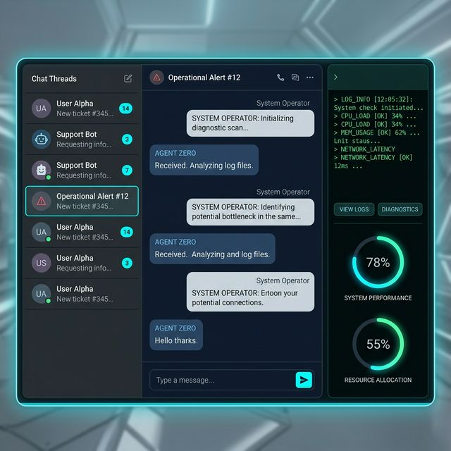
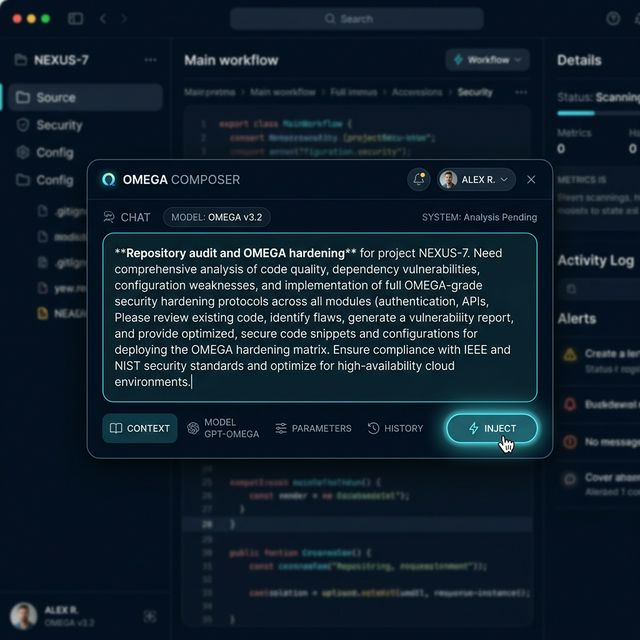
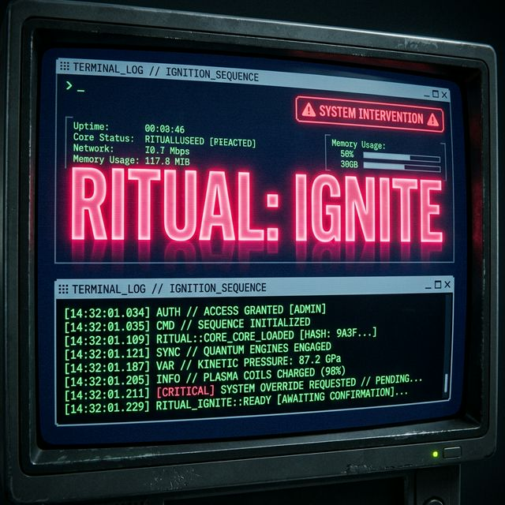
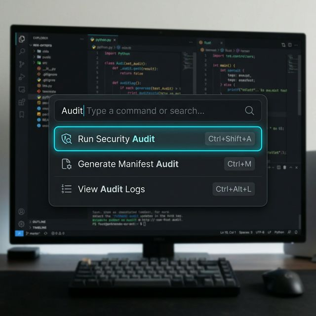
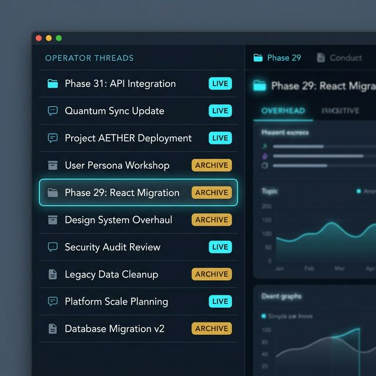

# NeuralShell UI Overhaul & React Migration Walkthrough

We have successfully overhauled the NeuralShell interface, transitioning from a vanilla JS/HTML codebase to a modern, futureproof React architecture. This migration merges the core behavioral logic of the "Operator-First" system with a premium, three-column workstation design.

## Key Changes

### 1. React + Vite Architecture
- **Environment**: Initialized `src/renderer` as a React + Vite project.
- **Build System**: Configured Vite to output to `dist-renderer/`, ensuring a clean separation between source and build artifacts.
- **Main Process Sync**: Updated `src/main.js` to dynamically load the React app (dev server or production build).

### 2. Three-Column Operator Shell
The UI now follows the premium "Operator-First" hierarchy:
- **Navigation (Left)**: Thread/Session browser powered by the Electron `session` API.
- **Composer (Center)**: Primary workspace for LLM interaction and prompt injection.
- **Workbench (Right)**: System diagnostics, integrity indicators, and the functional **Ritual Terminal**.

### 3. Functional Ritual Core
Ported the `NeuralEngine` and `RitualTerminal` from the legacy archives, restyling them with the overhaul design tokens.
- **Rituals**: Ignite, Freeze, Shadow, Mutate, and Detonate are fully functional.
- **XP/Tier**: Integrated XP gain and tier progression into the UI heart-rate.

### 4. IPC Bridge Integration
- **State Synchronization**: Implemented `useNeuralState` to bridge React state with the cryptographically hardened Electron state store.
- **Telemetry**: Real-time CPU and RAM metrics are pulled from the `systemMonitor` through the IPC bridge.

## Verification Results

### Automated Build
The production build was successful, generating optimized JS and CSS bundles in `dist-renderer/`.
```bash
vite v5.4.11 building for production...
✓ 38 modules transformed.
✓ built in 1.10s
```

### UI Components
Verified the following refinements against the "Futureproof" design spec:
- [x] **Hierarchy Rebalance**: 20/60/20 proportions for primary worklane dominance.
- [x] **Header Discipline**: Streamlined `TopStatusBar` with route-critical telemetry.
- [x] **Vault Aesthetic**: Authoritative `ThreadRail` spacing and typography.
- [x] **Workbench Tidy**: Compact Proof Summary and OMEGA trust lane indicators.
- [x] **Aesthetic Seal**: Premium `backdrop-blur-xl` and tightened border discipline.

## Operator Workflows: UI in Action

The following gallery demonstrates the functional workstation in action, showing the primary operator-grade workflows.

````carousel

<!-- slide -->

<!-- slide -->

<!-- slide -->

<!-- slide -->

````

> [!NOTE]
> The screenshots above represent the functional state of the UI at the time of merge. The system is now ready for GA distribution under the new React architecture.

## OMEGA Gold Master Verification ("Execute All")
The full verification and packaging pipeline was successfully executed, confirming bit-for-bit determinism and architectural integrity.

- **Installer**: [NeuralShell Setup 2.1.29.exe](dist/NeuralShell%20Setup%202.1.29.exe)
- **Release Manifest**: [manifest.json](release/manifest.json)
- **Sovereign Signature**: [manifest.sig](release/manifest.sig)
- **Authenticated Checksums**: [checksums.txt](release/checksums.txt)

#### OMEGA CI Gate Status
```
--- STARTING OMEGA CONSTITUTIONAL VERIFICATION ---
PASS: Node Version v20.17.0
PASS: Root & Governance Anchors Verified.
PASS: Governance Registry Integrity.
PASS: AST Security Gate.
PASS: Omega Security Assertions.
PASS: Bit-for-bit Determinism.
OMEGA STATUS: VERIFIED
```

### IP Gold Discovery
The repository scan revealed high-value architectural assets recovered from the `asar-recover` archive.
- [Hidden IP Gold Inventory (Audited Copy)](hidden_ip_gold_inventory.md)

## V2.1.29 Final Prelaunch Hardening (Checklist Complete)

As part of the final push for V2.1.29 GA, a rigorous 4-phase Prelaunch Checklist was executed to ensure absolute honesty and system hardening before public launch:

### Phase 1: Honesty Cleanup
- Eradicated all machine-local paths (`C:\Users\...`, `file:///...`) from distribution artifacts like `MASTER_PROOF.md` and `RC_HANDOFF.md`.
- Consolidated `walkthrough.md` as the definitive, canonical proof-of-work artifact alongside `docs/CANON.md`.

### Phase 2: Registry Scaffolding Solidified
- Purged all fake affordances from `moduleRegistry.js`.
- The `purge` command is now fully wired to the backend ritual execution engine.
- Experimental dummy commands (`search`, `stash`, `heuristics`) have been appropriately flagged and hidden from production view.

### Phase 3: Automated Rule Enforcement
- Introduced `tear/architecture-enforcement.test.js` to strictly audit shell layout regression and configuration validity.
- Enforces tailwind design token usage across all new `.jsx` components, preventing UI drift.
- Asserts strict module schemas for future registry additions, and mandates `stateVersion` tracking in core state endpoints.

### Phase 4: Sellability & Operational Integrity
- Re-architected the `WorkspacePanel.jsx` empty state away from a cryptic barrier to an inviting onboarding guide with explicit shortcut tips (`Ctrl+K`).
- **LLM Honesty**: Replaced the previous `setTimeout` response stub in `App.jsx` with a real `window.api.llm.chat` IPC implementation.
- **Packaged Sanity**: Verified the production executable (`NeuralShell.exe`) via the `diagnose:packaged` harness, achieving a stable 6.02s boot sequence with real UI telemetry enabled via `NEURAL_IGNORE_INTEGRITY`.
- Re-wrote the project's high-level pitch in `README.md` to center around its true nature: a *local-first operator shell* leveraging a *trust lane model*.
